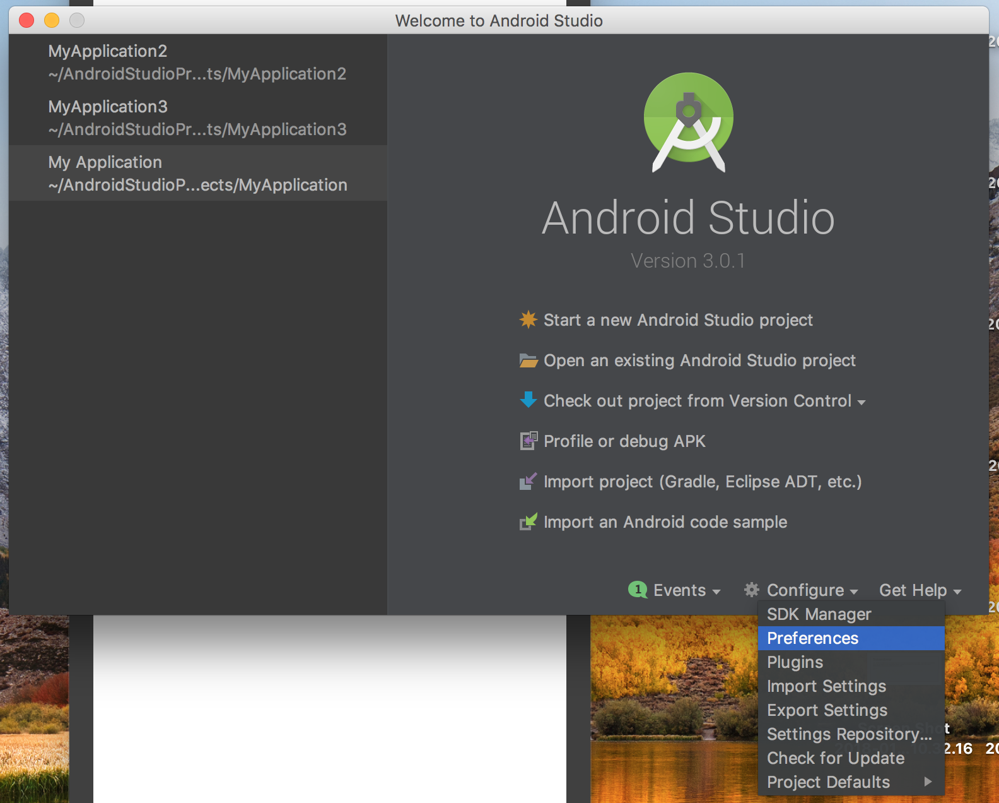
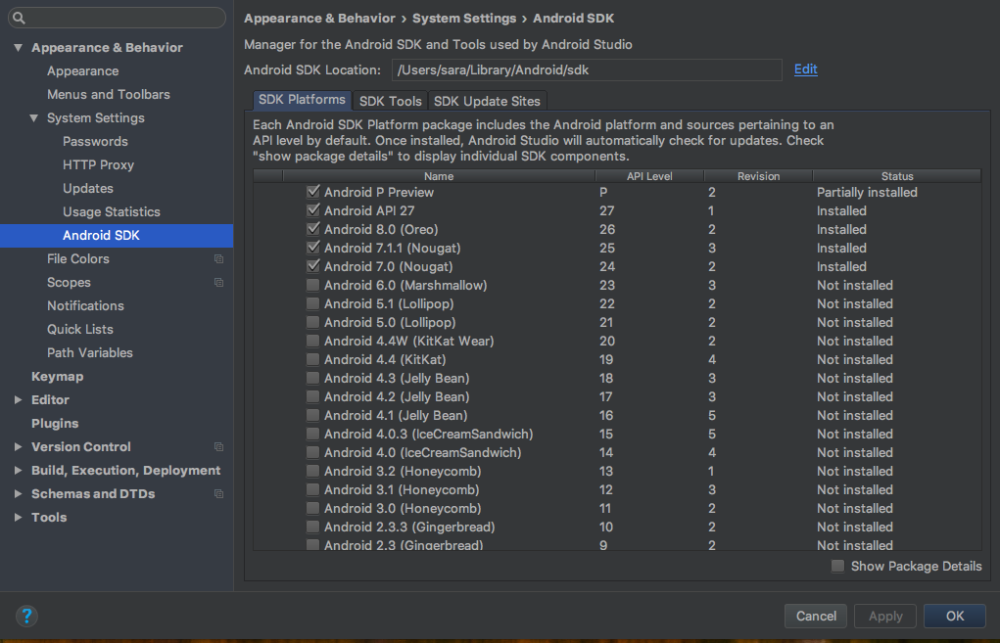
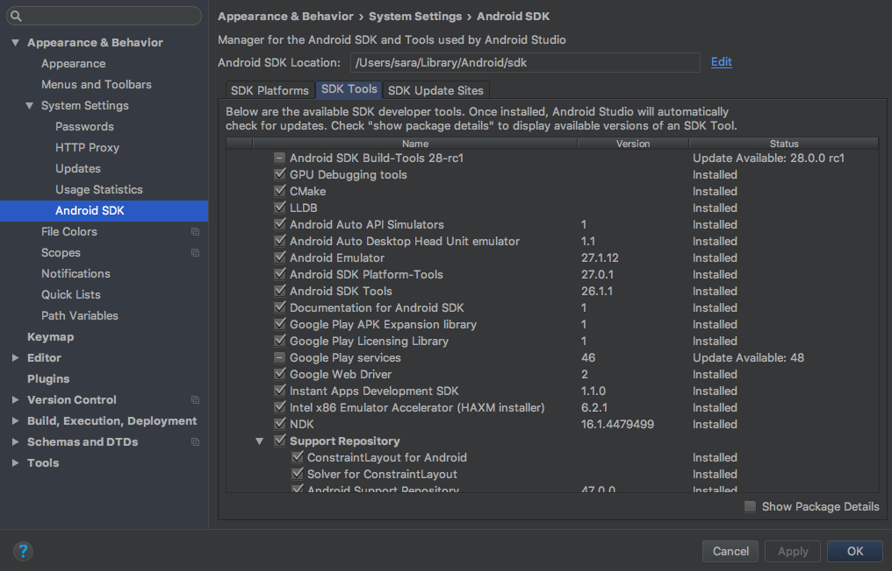
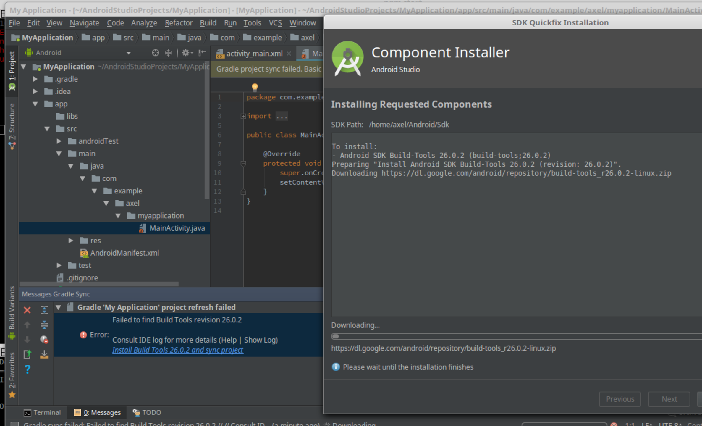
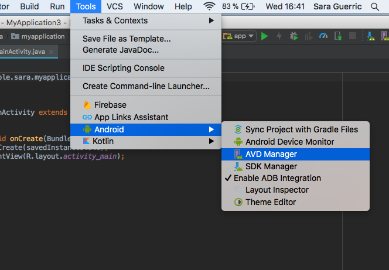
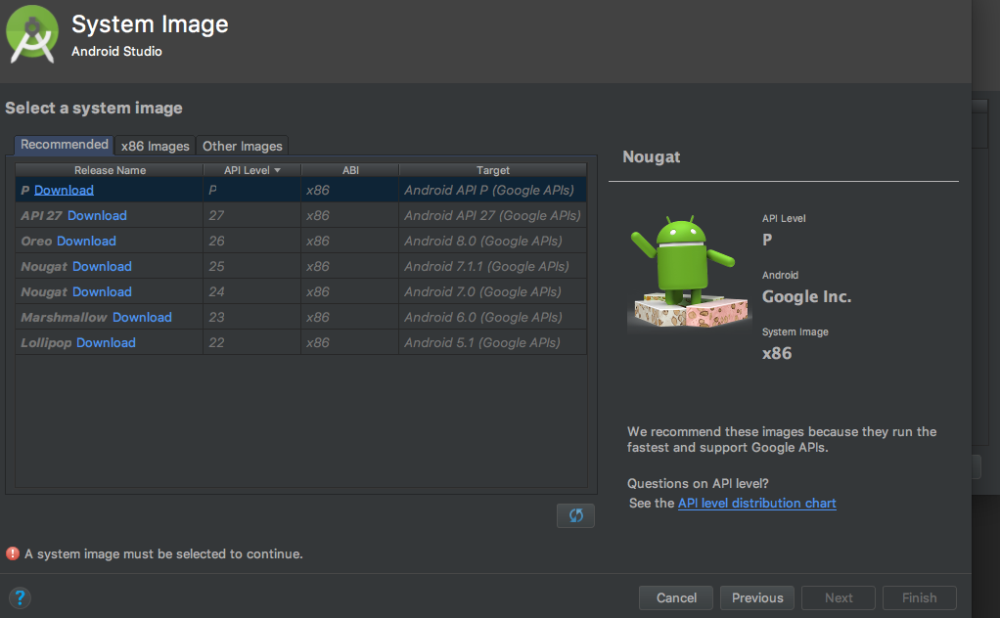

# Installation des plateformes

### Android

1. Installer Android Studio.
2. Ouvrir la configuration d'Android Studio.
    
3. Checker au moins _oreo_ sous _SDK Platforms_.
    
4. Checker tout ou au moins jusqu'à _Android SDK Tools_ sous _SDK Tools_. Sauf l'update de _Android SDK Build-tools_.
    
5. Créer un nouveau projet. En validant aveuglement toutes les étapes. Puis lorsque le projet s'ouvre une fenêtre affiche une erreur vous proposant d 'installer les build-tools.  Cliquer sur le lien proposé.
    
6. Dans le menu séléctionner Tools > Android > AVD manager. Ca vous ouvrira le _Android Virtual Device Manager_.
    
7. Créer un nouveau device, sélectionner _oreo_ comme plateforme et _Nexus 5_ comme device par exemple.
    
8. Lancer la VM en cliquant sur l'icone _play_.

---------------------------------

### Ios

1. Installer XCode.

------------------------------------

### react-native

1. Installer la version 4 de npm :
```
$ sudo npm i -g npm@4
```

2. Installer create-react-native-app :
```
$ sudo npm i -g create-react-native-app
```

3. Créer un nouveau projet :
```
$ create-react-native-app myproject
```

4. Dans le projet lancer le packager :
```
$ npm start
```

- Un QR code s'affiche, installer l'application expo sur votre smartphone ou tablette. Flasher le QR code. votre application s'affiche dans votre téléphone en live-reload.
- Pour Android, si vous avez un Android Virtual Device (AVD) lancé ou un device branché en USB, vous pouvez aussi taper la lettre _a_
- Pour ios, vous pouvez taper la lettre i.

C'est bon vous êtes prêts : Happy hacking !
