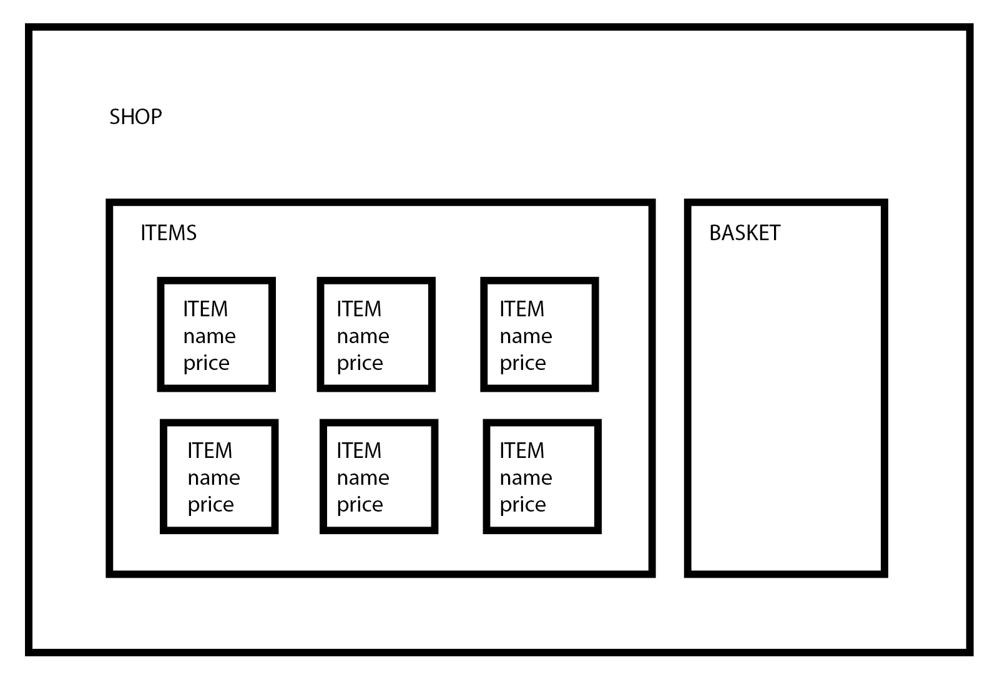
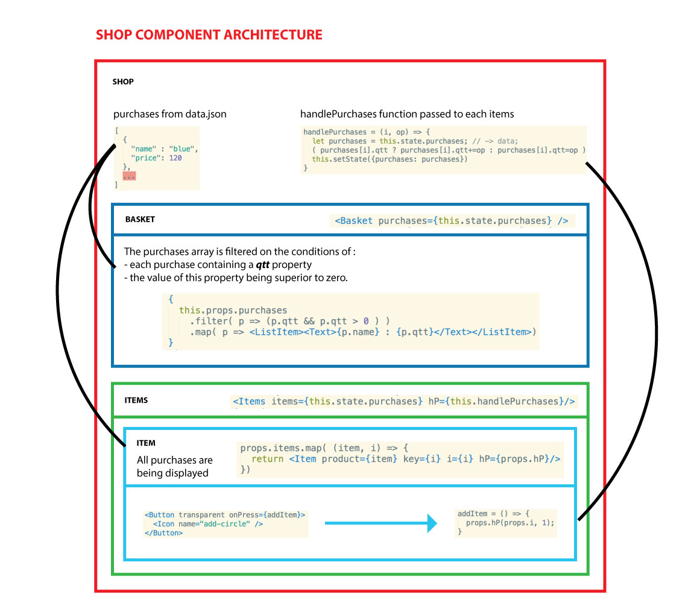

# Shop




----------------------

# Objectifs

### Jeudi matin

1. Créer un component _Shop_ avec un `<Text>` _SHOP_.
2. Dedans créer components _Items_ et _Basket_ avec un `<Text>` _BASKET_.
3. Créer un tableau d'objets json type :
    ```
    items = [
            {
                name: "shoes",
                price: 20
            },
            ...
        ]
    ```
4. Créer un component _Item_ avec trois `<Text>` _ITEM_ _name_ et _price_.

### Jeudi après-midi

1. Linker un framework d'UI components pour votre app, type _elements_ ou _native-base_. 
2. Faire en sorte d'itérer sur le tableau json pour générer tout vos items.
3. Créer un bouton _Add_ pour chaque items.
4. Faire en sorte que ce bouton lance une function qui rajoute l'item à un tableau _purchase_.

### Vendredi

1. Rajouter la possibilité de add et remove.
2. S'assurer que l'item n'apparaisse qu'une fois dans le panier et que ça soit sa quantité qui augmente.
3. Afficher un total.

--------------------------

# Solution proposée

1. La structure proposée est dans components.


